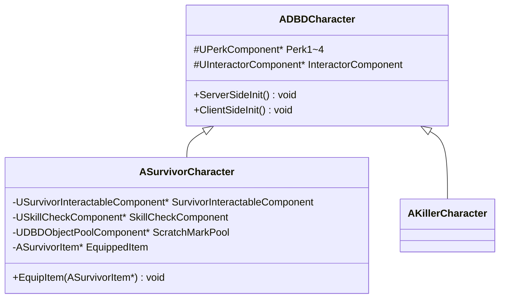
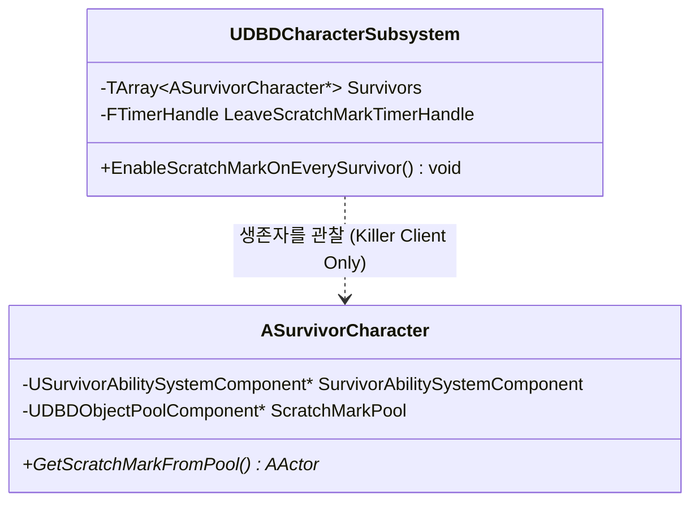
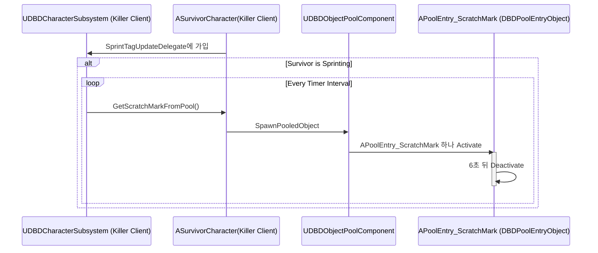
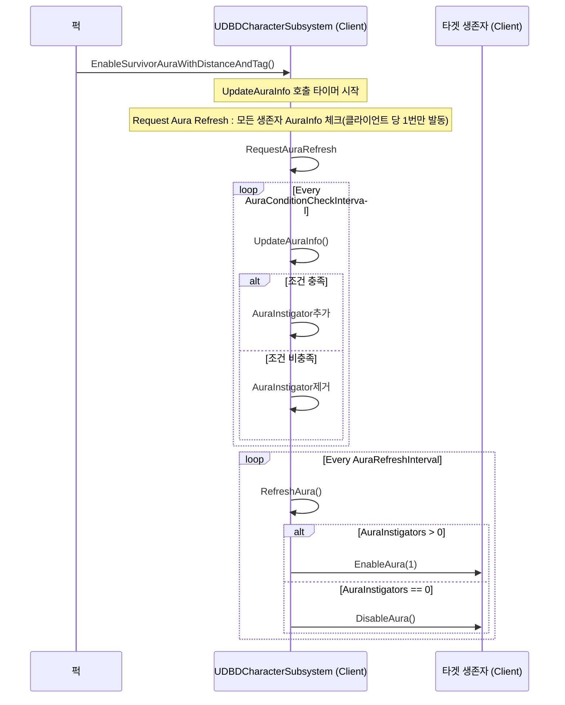
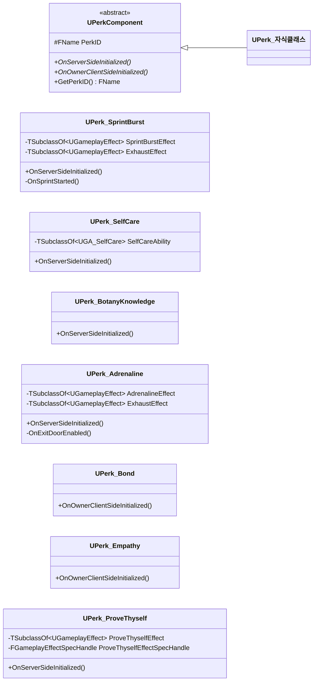
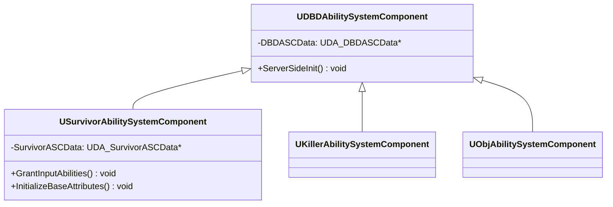
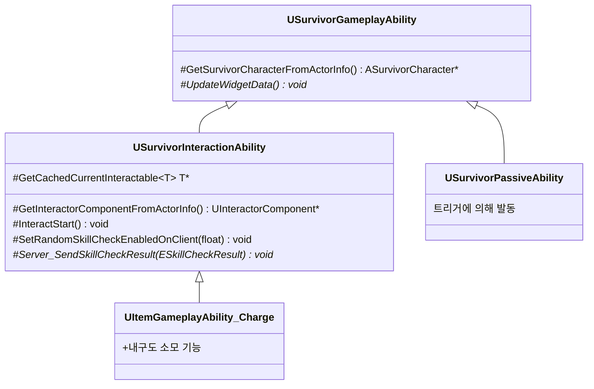
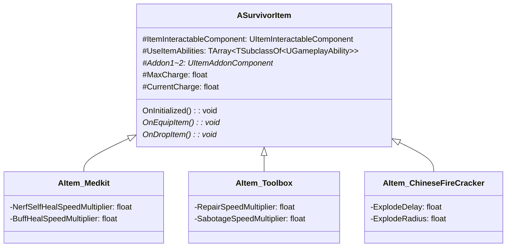
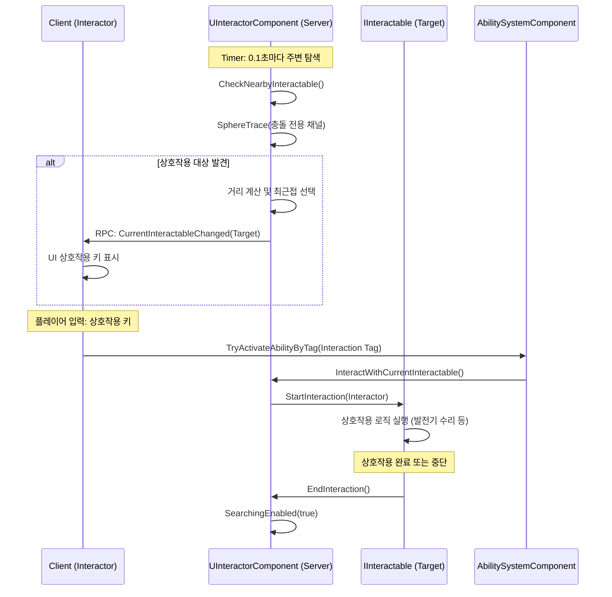

# Dead by Daylight 모작 프로젝트

[](https://youtu.be/Mh9_ZfwXtZ0)


## 목차

1. [프로젝트 소개](#프로젝트-소개)
2. [하이라이트](#하이라이트)
3. [기술 스택](#기술-스택)
4. [팀원 및 역할](#팀원-및-역할)
5. [주요 기여 및 담당 역할](#주요-기여-및-담당-역할)
    - [기여 영역 요약](#기여-영역-요약)
6. [세부 구현](#세부-구현)
    - [1. 캐릭터 기반 및 생존자 클래스](#1-캐릭터-기반-및-생존자-클래스)
    - [2. 발자국 시스템](#2-발자국-시스템)
    - [3. 오라 시스템](#3-오라-시스템)
    - [4. 퍽 시스템](#4-퍽-시스템)
    - [5. Gameplay Ability System (GAS) 적용](#5-gameplay-ability-system-gas-적용)
    - [6. 아이템 시스템](#6-아이템-시스템)
    - [7. 상호작용 시스템](#7-상호작용-시스템)
    - [8. 유틸리티 클래스](#8-유틸리티-클래스)

---
## 프로젝트 소개

이 프로젝트는 멀티플레이어 PVP 게임 **Dead by Daylight**를 모작하여 구현한 팀 프로젝트입니다.  
**Unreal Engine 5**와 <b>C++</b>를 기반으로 개발되었으며, **Dedicated Server** 환경에서 동작하도록 설계되었습니다.  
특히 <b>Gameplay Ability System (GAS)</b>을 활용하여 캐릭터의 스킬, 상태 이상, 상호작용 시스템을 확장성 있는 객체 지향적 구조로 구현하는 데 중점을 두었습니다.

저는 이 프로젝트에서 **팀장 및 생존자 캐릭터 개발**을 맡아 **캐릭터의 전체 구조 설계 및 구현**,**퍽 시스템 구현**, **공용 상호작용 시스템**, **GAS 기반 어빌리티 시스템**에 기여하였습니다.

---


## 하이라이트

### 객체 지향 설계 (OOP)

- **단일 책임 원칙**: 아이템, 애드온, 캐릭터의 분리
- **다형성 활용**: 가상함수를 이용해 퍽 클래스 확장
- **의존성 역전 원칙**: 인터페이스를 통한 상호작용 시스템 구현

### 디자인 패턴

- **Object Pool Pattern**: 발자국 시스템 성능 최적화
- **Observer Pattern**: 어빌리티 UI 시스템, 오라 시스템
- **State Pattern**: GameplayTag에 따른 캐릭터의 행동 로직 관리

### 성능 최적화

- **메모리 관리**: Object Pooling으로 발자국 스폰 시 메모리 할당/해제 최소화
- **효율적인 자료구조**: 주기적으로 순회하는 오라 정보 컨테이너를 TArray로 사용하여 캐시 히트를 높임

---

## 기술 스택

| 분류 | 기술 | 비고 |
|:---|:---|:---|
| **Engine** | **Unreal Engine 5** | C++, Blueprint |
| **Framework** | **Gameplay Ability System (GAS)** | 스킬 구현, 상태 관리 |
| **Network** | **Dedicated Server** | Replication, RPC |
| **Input** | **Enhanced Input System** | GAS와 연결 |
| **Tools** | Notion, Discord, Perforce, Rider | 협업 및 형상관리 |

---

## 팀원 및 역할
| 이름 | 역할 | 담당 파트 |
|:---:|:---:|:---|
| **정민수 (팀장)** | **Survivor** | **생존자 캐릭터, 상호작용 시스템, 퍽 시스템, 캐릭터 오라 및 발자국 시스템** |
| 모명준 | Object | 로비, 게임 플로우, 오브젝트, 상호작용 시스템, 오브젝트 오라 시스템 |
| 김미진 | Killer | 살인마 캐릭터, UI 베이스 설계 |
| 유호근 | Map | 맵 랜덤 생성 시스템, 라이팅 |

## 주요 기여 및 담당 역할

저는 팀의 리더로서 프로젝트의 방향을 잡고, 기반 시스템을 구현했습니다. 단순한 기능 구현을 넘어, **객체 지향 원칙**과 **언리얼 엔진의 설계 철학**을 준수하여 유지보수가 쉽고 확장이 용이한 코드를 작성했습니다.

### 기여 영역 요약

| 영역 | 기여도 | 주요 내용 |
|:---|:---:|:---|
| **생존자 캐릭터** | 100% | 캐릭터 구조 설계, GAS 연동 설계, 상태 관리, 입력 시스템, 네트워크 동기화 |
| **상호작용 시스템** | 50% | 인터페이스 기반 설계, 컴포넌트 구조, 네트워크 동기화, RPC기반 캐릭터 상호작용 애니메이션 동기화 |
| **퍽 시스템** | 100% | 퍽 베이스 클래스 및 초기화 로직 구현, 7개 퍽 구현 |
| **아이템 시스템** | 100% | 아이템 베이스 클래스, 장착 및 해제 구현, 애드온 시스템 구현 |
| **캐릭터 오라 및 발자국 시스템** | 100% | CustomDepth 기반 오라 시각화, DecalComponent활용한 발자국 시각화, 중복 오라 처리, 서브시스템 활용한 네트워크 독립적 구조 설계 |
| **공유 프레임워크** | 60% | 베이스 캐릭터 설계, 유틸리티 클래스, 데이터 구조 정의 |

---

## 세부 구현

### 1. 캐릭터 기반 및 생존자 클래스

**관련 파일:**
- [SurvivorCharacter.cpp](https://github.com/jms3230/DBDProject/blob/master/Source/DBDProject/Private/JMS/Character/SurvivorCharacter.cpp)
- [DBDCharacter.cpp](https://github.com/jms3230/DBDProject/blob/master/Source/DBDProject/Private/Shared/Character/DBDCharacter.cpp)

#### 설계 방향

**상속 구조**를 통해 공통 기능을 재사용하고, 중요 기능을 컴포넌트화 하여 **단일 책임 원칙**을 준수하도록 설계되었습니다. 또한 **GameplayTag**를 활용해 **State 패턴**으로 상태 별 로직을 구현하였습니다.

#### 클래스 계층 구조



#### 상태 관리 시스템

GameplayTag 기반의 상태 관리를 통해 복잡한 캐릭터 상태를 처리합니다:

**Tag예시**

- **`Survivor.Status.Injured`**: 부상 상태
- **`Survivor.Status.Dying`**: 빈사 상태
- **`Survivor.Status.Captured.Hook`**: 갈고리 걸림 상태
- **`Survivor.Status.Captured.Killer`**: 살인마에게 잡힘 상태

상태 전환에 대한 로직은 다음 세가지를 활용하였습니다.
<b>
*   GameplayAbility Trigger
*   GameplayTagEvent
*   AttributeValueChangeDelegates
</b>
---

### 2. 발자국 시스템

**관련 파일:**
- [DBDCharacterSubsystem.cpp](https://github.com/jms3230/DBDProject/blob/master/Source/DBDProject/Private/Shared/Subsystem/DBDCharacterSubsystem.cpp)
- [PoolEntry_ScratchMark.cpp](https://github.com/jms3230/DBDProject/blob/master/Source/DBDProject/Private/JMS/ScratchMark/PoolEntry_ScratchMark.cpp)
- [DBDObjectPoolComponent.cpp](https://github.com/jms3230/DBDProject/blob/master/Source/DBDProject/Private/Shared/ObjectPool/DBDObjectPoolComponent.cpp)

#### 설계 방향

생존자가 달릴 때마다 생성되는 발자국은 매 틱마다 엑터의 생성과 삭제를 반복해야 합니다. 또한, 발자국은 **살인마(Killer)**에게만 보여야 하므로 모든 클라이언트에 동기화할 필요가 없습니다.


따라서 **DBDCharacterSubsystem**을 통해 **살인마 클라이언트**에서만 독립적으로 발자국 생성하고, **오브젝트 풀링**으로 메모리 비용을 최적화했습니다.





---

### 3. 오라 시스템

**관련 파일:**
- [DBDCharacterSubsystem.cpp](https://github.com/jms3230/DBDProject/blob/master/Source/DBDProject/Private/Shared/Subsystem/DBDCharacterSubsystem.cpp)
- [DBDCharacter.cpp](https://github.com/jms3230/DBDProject/blob/master/Source/DBDProject/Private/Shared/Character/DBDCharacter.cpp)

#### 설계 방향

오라(Aura)는 모든 플레이어에게 보이는 것이 아니라, **특정 퍽(Perk)을 장착한 생존자 클라이언트**에서만 보여야 합니다. 이를 구현하기 위해 **UDBDCharacterSubsystem**이 클라이언트 전용 로직을 수행합니다.

오라는 조건이 만족될 경우에만 보이므로 모든 생존자의 상태를 주기적으로 점검해야 합니다. 이를 최적화 하기 위해 관련 퍽이 있는 플레이어의 클라이언트에서만 점검합니다.

#### 주요 함수

```cpp
// UDBDCharacterSubsystem.h
void EnableSurvivorAuraWithDistanceAndTag(
    UObject* AuraInstigator, 
    ADBDCharacter* EffectOwner, 
    float Distance,
    FGameplayTagContainer RequiredTags,
    FGameplayTagContainer BlockedTags
);
```
#### 활용 사례

- **Bond 퍽**: Bond 퍽을 든 생존자 화면에서만 10m 내 다른 생존자의 오라가 보임
- **Empathy 퍽**: Empathy 퍽을 든 생존자 화면에서만 20m 내 부상당한 생존자의 오라가 보임

#### 동작 시퀀스


---

### 4. 퍽 시스템

**관련 파일:**
- [PerkComponent.cpp](https://github.com/jms3230/DBDProject/blob/master/Source/DBDProject/Private/Shared/Perk/PerkComponent.cpp)
- [JMS/Perk/ 7개 퍽 구현](https://github.com/jms3230/DBDProject/tree/main/Source/DBDProject/Private/JMS/Perk)
#### 설계 방향
**다형성**을 활용해 베이스 구조의 변경 없이 OnServerSideInitialized, OnOwnerClientSideInitialized 함수 오버라이드 만으로 여러가지 퍽을 만들 수 있게 하였습니다. 만들어진 퍽은 데이터테이블에 담아 체계적으로 관리하였습니다.
#### 구현된 퍽 목록

| 퍽 이름 | 효과 | 구현 방식 |
|:---|:---|:---|
| **Sprint Burst** | 질주 시작 시 3초간 이동속도 150% + 탈진 효과(광역 쿨타임 역할) | GameplayTagEvent 트리거 -> GameplayEffect 적용 |
| **Self Care** | 치료 도구 없이 자가 치료 가능 | GameplayAbility 부여 |
| **Botany Knowledge** | 치료 속도 33% 증가 | GameplayEffect 적용 |
| **Adrenaline** | 탈출구 개방 시 즉시 건강상태 1단계 회복 + 3초간 이동속도 150% + 탈진 효과(광역 쿨타임 역할) | Delegate가입, GameplayEffect 적용 |
| **Bond** | 10m 내 동료 오라 표시 | 캐릭터 서브시스템 사용 |
| **Empathy** | 20m 내 부상 동료 오라 표시 | 캐릭터 서브시스템 사용 |
| **Prove Thyself** | 주변 생존자 수 만큼 광역 버프(발전기 수리 속도 증가) | GameplayEffect레벨 + CurveTable로 버프 수치 적용, 캐릭터 서브시스템으로 거리 연산 |

#### 퍽 클래스 구조


---

### 5. Gameplay Ability System (GAS) 적용

**관련 파일:**
- [생존자 GAS 관련 클래스 구현](https://github.com/jms3230/DBDProject/tree/main/Source/DBDProject/Public/JMS/GAS)

#### AbilitySystemComponent 상속 구조



#### 주요 GameplayAbility 예시

##### 1) 기본 행동 어빌리티

- **GA_Survivor_Move**: 이동 처리
- **GA_Survivor_Crouch**: 웅크리기
- **GA_Survivor_Sprint**: 질주

##### 2) 상호작용 어빌리티

- **GA_Survivor_RepairGenerator**: 발전기 수리
- **GA_Survivor_HealOther**: 동료 치료
- **GA_SelfCare**: SelfCare퍽에 의해 부여되는 어빌리티
- **GA_Survivor_Rescue**: 갈고리 구출
- **GA_Survivor_OpenExitDoor**: 탈출구 개방
- **GA_Survivor_PickUpItem**: 아이템 습득

##### 3) 패시브 어빌리티

- **GA_Survivor_Dying**: 빈사 상태 처리
- **GA_Survivor_HookedIn**: 갈고리 걸림 상태
- **GA_Survivor_CapturedByKiller**: 킬러에게 잡힘
- **GA_Survivor_Escape**: 탈출 처리



#### AttributeSet 설계

**USurvivorAttributeSet**는 생존자의 핵심 능력치를 정의합니다:

| Attribute | 설명 | 복제 여부 |
|:---|:---|:---:|
| `MovementSpeed` | 기본 이동 속도 | - |
| `SprintSpeed` | 질주 속도 | - |
| `HealProgress` | 치료 진행도 (0.0 ~ 1.0) | - |
| `DyingHP` | 빈사 상태 HP | - |

네트워크 동기화를 통해 서버의 Attribute 변경이 모든 클라이언트에 자동 반영됩니다.

#### GameplayTag 활용

Tag 기반 시스템으로 복잡한 조건부 로직을 단순화했습니다:

```
Survivor.Status.Normal
Survivor.Status.Injured
Survivor.Status.Dying
Survivor.Status.Captured.Hook
Survivor.Ability.Interaction.RepairGenerator
Survivor.Ability.Interaction.HealOther
Survivor.Status.Sprinting
Interactable.Object.Generator
Interactable.Character.Survivor
Interactable.Object.Hook
```

---

### 6. 아이템 시스템

**관련 파일:**
- [SurvivorItem.cpp](https://github.com/jms3230/DBDProject/blob/master/Source/DBDProject/Private/JMS/Item/SurvivorItem.cpp)
#### 설계 방향
아이템은 떨어뜨리면 다른 생존자가 주울 수 있는 독립적인 액터입니다. 따라서 **단일 책임 원칙**을 지킬 수 있도록 멤버를 구성하였습니다. 애드온을 통해 아이템을 강화할 수 있고 이 또한 독립적인 컴포넌트 클래스입니다. 

#### 아이템 종류

| 아이템 | 기능 |
|:---|:---|
| **Medkit** | 자가 치료 또는 동료 치료 속도 증가 |
| **Toolbox** | 발전기 수리 속도 증가, 갈고리 파괴 |
| **Firecracker** | 폭발 후 주변에 실명 태그 부여 |

#### 클래스 구조


---

### 7. 상호작용 시스템

**관련 파일:**
- [InteractorComponent.cpp](https://github.com/jms3230/DBDProject/blob/master/Source/DBDProject/Private/Shared/Component/InteractorComponent.cpp)

#### 설계 방향: 
상호작용은 인터페이스 끼리 신호를 주고받고, 세부 기능은 각 클래스 별로 구현하여 **의존성 역전 원칙**을 지키도록 의도하였습니다. InteractorComponent는 신호를 주는 쪽의 컴포넌트로, 서버에서만 동작하고, 별도의 충돌 채널을 사용합니다.

주기적으로 주변을 탐색하여 플레이어에게 GameplayTag를 통해 미리 정보를 표시하여 주고, 탐색 주기를 Tick대신 타이머로 관리하여 연산 효율을 높였습니다.

#### 상호작용 흐름


### 8. 유틸리티 클래스
#### 설계 방향
전역적으로 사용 가능한 GAS 관련 유틸리티, 애니메이션 동기화 연산 관련 유틸리티, 디버그 유틸리티를 구현하여 개발 효율을 높였습니다.

**관련 파일:**
- [DBDBlueprintFunctionLibrary.cpp](https://github.com/jms3230/DBDProject/blob/master/Source/DBDProject/Private/Shared/DBDBlueprintFunctionLibrary.cpp)
- [DBDDebugHelper.cpp](https://github.com/jms3230/DBDProject/blob/master/Source/DBDProject/Private/Shared/DBDDebugHelper.cpp)

#### DBDBlueprintFunctionLibrary

블루프린트에서 사용 가능한 유틸리티 함수 제공:
- GAS 관련 헬퍼 함수
- 애니메이션 시작 전 메시 소켓 기반 위치 계산 함수

#### DBDDebugHelper

개발 중 디버깅을 위한 시각화 도구:
- PIE창, 로그 창 모두 메시지 출력
- NetMode 검사 메시지 출력
- 가변 인자 Printf 스크린 출력
- Server, Client 별 디버그 메시지
